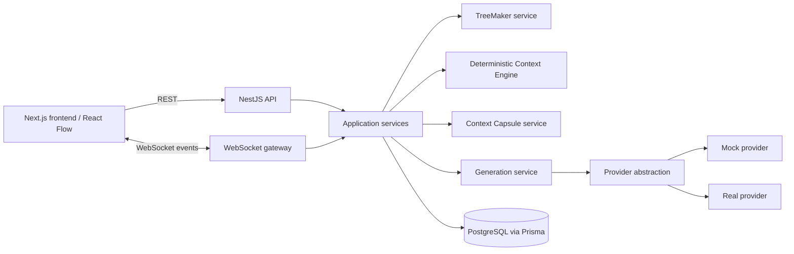
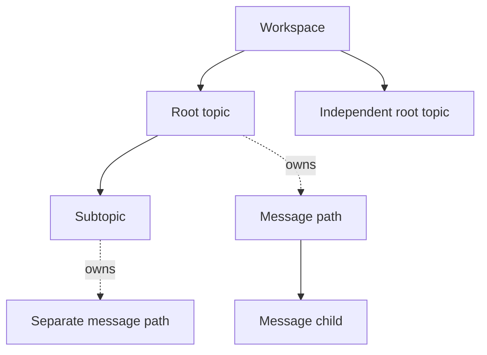

# ArborAI architecture

## Target architecture and current compatibility

The target product uses a Next.js frontend with React Flow, a NestJS API,
PostgreSQL, provider adapters, and a WebSocket gateway. The current scaffold is
compatible but not yet migrated: it uses Vite/React, a TypeScript Node HTTP API,
Prisma/PostgreSQL, and no live WebSocket transport. Preserve the working stack
until a ticket deliberately performs that migration; logical boundaries below
apply to both shapes.



## Responsibility boundaries

Controllers and the gateway call application services, which call domain
services and repositories/provider adapters. The Context Engine has no
dependency on HTTP, React, WebSockets, or provider SDK types.

- **Frontend:** renders the topic forest and message branches, submits prompt
  modes, displays placement/context feedback, and refetches graph state after a
  realtime reconnect.
- **TreeMaker:** receives a compact topic index plus the prompt, chooses one
  placement action, and returns structured output. It never writes arbitrary
  output directly, disables/archives/prunes content, or answers the user.
- **Context Capsule service:** creates/updates compact, validated topic
  capsules after meaningful successful exchanges. Failure does not invalidate a
  completed answer.
- **Context Engine:** deterministically produces included messages, exclusions,
  warnings, token estimate, and trimming from workspace/topic/message state.
- **Generation service:** validates lifecycle transitions, persists a snapshot
  before streaming, invokes the provider, persists deltas/final usage, and
  updates capsules after success.
- **Provider abstraction:** exposes structured output and streamed answering;
  mock mode is offline and deterministic, while real-provider credentials stay
  backend-only.

## Topic and message hierarchy



Solid edges are topic hierarchy (`parentTopicId`); dotted ownership edges are
`topicId`; message edges are `parentId`. These relationships must never be
flattened into one tree.

## Auto-route generation lifecycle

```mermaid
sequenceDiagram
  participant U as User / React Flow
  participant A as API
  participant T as TreeMaker
  participant C as Context Engine
  participant P as Provider
  participant D as PostgreSQL
  participant W as WebSocket gateway
  U->>A: auto_route prompt + current selection
  A->>T: compact tree index + prompt
  T-->>A: validated placement decision
  A->>D: persist TreeMaker run and topic/user node
  A->>C: assemble deterministic context
  C-->>A: messages, exclusions, warnings, budget
  A->>D: persist generation + snapshot + pending assistant node
  A->>P: stream answer
  P-->>A: deltas / usage / completion
  A->>D: persist state and content
  A->>W: scoped realtime event
  W-->>U: graph update
  A->>D: complete generation; update capsule when meaningful
```

When TreeMaker output is invalid or fails, the safe fallback continues the
active topic or creates a prompt-derived root topic. Low confidence instead
returns clarification; it does not silently create a generation.

## Persistence and compatibility

PostgreSQL is accessed through Prisma in the current code. Existing
`Conversation`, `Topic`, and `ConversationNode` records remain compatible:
topics are first class and messages retain `topicId` plus `parentId`.
Additive migrations persist topic capsules, TreeMaker runs, generations,
immutable context snapshots, and `pinned` without manufacturing full ancestor
transcript copies. TreeMaker, context assembly, provider invocation, and the
generation lifecycle are not implemented by the persistence layer alone.
