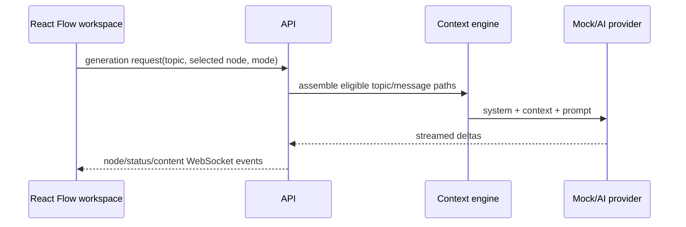

# ArborAI architecture

## Current repository state

ArborAI is a topic-aware visual workspace. The frontend is React/React Flow (Vite in the current scaffold), the API is TypeScript HTTP with Prisma, and PostgreSQL stores conversations, topics, and message nodes. The architecture is compatible with the planned Next.js/NestJS deployment shape.

## Components

### Web application

`apps/web/` contains the React Flow forest workspace. Topic nodes and message nodes have distinct graph semantics; roots are independent topics, child topics attach to parent topics, and messages attach to their owning topic.

### API application

`apps/api/` exposes conversation, topic, message-context, and generation operations, coordinates the topic-aware context engine and AI-provider abstraction, persists changes, and publishes response-stream events over WebSockets.

The conversation REST API currently exposes `GET/POST /conversations` and `GET/PATCH/DELETE /conversations/:conversationId`. Creation and updates validate a non-empty title (maximum 200 characters) and a system prompt of at most 10,000 characters. Collection results are ordered by most recently updated conversation; tree nodes are ordered by creation time. A conversation load returns metadata plus all non-pruned nodes, including `parentId` and `activeNodeId`. Invalid UUIDs return `400` and missing conversations return `404` with `{ "error": { "code": "...", "message": "..." } }`.

### Shared package

`packages/shared/` contains the contracts shared by the web and API applications: conversation DTOs, node enums, WebSocket event names, and dependency-free runtime validators for external request payloads. Its public API is exported from `packages/shared/src/index.ts`, and the package must remain independent of both applications.

### Persistence

PostgreSQL will persist conversations and their nodes. The primary relationship is the node `parentId`, which forms a tree while `conversationId` scopes nodes to a conversation.

## Topic-aware data model

```text
Conversation (workspace)
  id
  title
  systemPrompt
  activeTopicId
  createdAt
  updatedAt

Topic
  id, conversationId, parentTopicId, title, description
  activeNodeId, contextEnabled, archivedAt

ConversationNode (message)
  id
  conversationId, topicId
  parentId
  role
  content
  status
  tokenCount
  contextEnabled
  errorMessage
  prunedAt
  createdAt
  updatedAt
```

Submitting a prompt from an existing node creates a new user node in the selected topic. Regeneration may create multiple assistant children of one user node. Topic hierarchy never uses message `parentId`.



## Context assembly

The context-management engine starts at the selected node and walks parent links toward the root. It orders the relevant messages chronologically, adds the conversation system prompt, and assembles the model request. This keeps unrelated sibling branches out of the request while allowing users to revisit and branch from prior history. Token counts are recorded on nodes so the implementation can measure context size and benchmark reductions.

## Request and streaming lifecycle

1. The web client selects a node and submits a prompt.
2. The API validates the request and creates a user node under the selected node.
3. The API assembles context by walking that node's ancestry, then creates a pending assistant node.
4. The API invokes the configured model provider. Development and CI must support a mock/offline provider without a paid API key.
5. As output arrives, the API persists partial assistant content and emits WebSocket events for the node/status/content update.
6. The web client applies those events to the React Flow graph and renders the streaming response.
7. On completion, the API records the final status and token count. On failure, it records `errorMessage` and emits an error/completion event.

WebSocket event names belong in `packages/shared/` and are exposed through the `WebSocketEvent` constant. Any contract change must be reflected in the relevant documentation and tests. The current request validators cover conversation creation, branch creation, and generation-start payloads; response and event payload validation can be extended as those transports are implemented.

## Persistence

Prisma manages the PostgreSQL schema in `apps/api/prisma`. Deleting a conversation cascades to its nodes. Deleting an individual node sets its children's `parentId` to null, preserving those nodes; application code must still validate that a new parent belongs to the same conversation. `prunedAt` is a soft-prune marker: normal repository queries exclude marked nodes, while the rows remain recoverable.

The initial migration creates indexes for conversation lookup, parent lookup, and conversation chronology. The development seed creates one conversation with a prompt/response path and two branches.

## Local development

PostgreSQL is configured with `DATABASE_URL` in `apps/api/.env`. From the repository root, use `npm run db:migrate --prefix apps/api` to apply migrations and `npm run db:seed --prefix apps/api` to add development data. `npm run db:reset --prefix apps/api` is destructive and intended only for local development; it resets the database and runs the seed automatically. Keep `AI_PROVIDER=mock` for offline development. The web app runs at `http://localhost:5173` and uses `VITE_API_URL` or defaults to `http://localhost:3001`.
