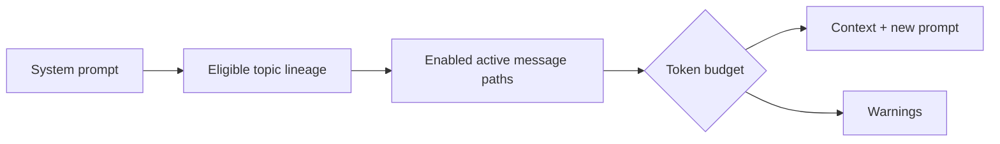

# Context rules

Context is assembled for the active topic and selected message path:

1. Add the workspace system prompt.
2. Add titles and descriptions for the root-to-active-topic lineage.
3. Add enabled messages on the active path of each enabled ancestor topic.
4. Add enabled messages on the selected path in the active topic.
5. Add the new user prompt.

Independent root topics, sibling subtopics, unselected alternative responses, context-disabled topics, context-disabled messages, archived topics, and pruned messages are excluded. Exclusion never deletes or hides content. Topic exclusion is inherited by descendants unless explicitly re-enabled by a future policy; an individually disabled message is excluded while its topic remains visible.

If an enabled descendant depends on an excluded message, the context builder emits a warning and omits the dependent message rather than constructing a misleading partial path. Token-budget trimming removes the oldest eligible context messages first, preserves the system prompt and new prompt, and emits a trimming warning with the removed node IDs.

