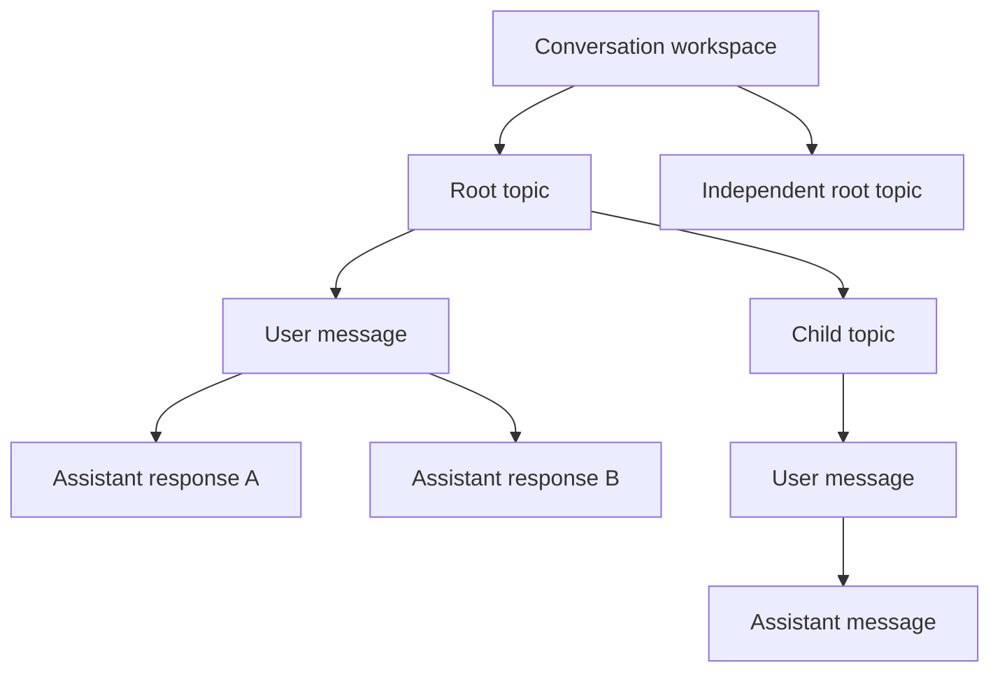

# ArborAI product model

ArborAI models a Conversation as the overall workspace. A workspace contains independent or nested Topics and each Topic contains message nodes.

- A root Topic is an independent subject in a workspace.
- A child Topic is a subtopic of another Topic; topic hierarchy is separate from message hierarchy.
- A ConversationNode is a user or assistant message belonging to exactly one Topic.
- `parentId` links messages within one Topic. A message branch is one conversational path.
- Alternative assistant responses are multiple assistant children of one user node; they are optional branches, not the workspace structure.
- Topic and message context selection is independent from archive/prune state. Exclusion keeps content visible; archive and prune are lifecycle operations.
- `activeTopicId` selects the workspace topic. `Topic.activeNodeId` selects its active message path. UI selection may select either one topic or one message at a time.

