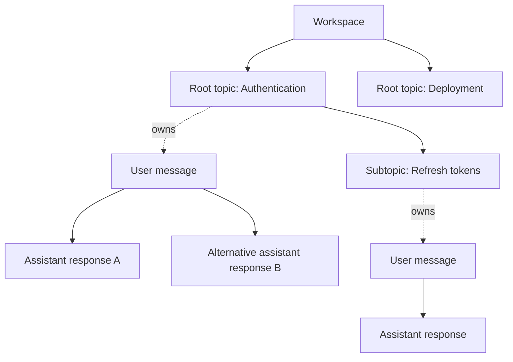

# ArborAI product model

ArborAI is a visual AI knowledge workspace. An AI routing agent automatically
organizes prompts into an existing topic, a new subtopic, or an independent root
topic. A deterministic Context Engine then assembles enabled topic capsules and
the selected message path for the answering model.

The workspace is not merely an alternative-response tree: topic hierarchy and
message branching are distinct structures.

## Core terms

| Term | Meaning |
| --- | --- |
| Workspace | The top-level environment containing topics, messages, settings, and generations. `Conversation` may remain the persistence name during compatibility work. |
| Root topic | An independent subject with no parent topic. Its context is isolated from other root topics. |
| Subtopic | A topic under another topic, with its own messages and a compact inherited understanding of its lineage. |
| Message node | One user or assistant message belonging to exactly one topic. `parentId` links messages only within that topic. |
| Alternative assistant response | An explicitly requested regenerated response: another assistant child of the same user message. It is not created by a normal follow-up. |
| Topic context capsule | A bounded, self-contained summary of durable facts, decisions, constraints, and open questions for one topic, with source IDs. It is not an ancestor transcript copy. |
| TreeMaker run | A persisted, debuggable routing attempt containing compact tree input, a validated placement decision, confidence, and fallback/error state. |
| Generation | One answering-model operation: placement, user and assistant nodes, context snapshot, model configuration, usage, and terminal status. |
| Generation context snapshot | An immutable record of exactly the messages, inclusions, exclusions, warnings, and budget used for one generation. It is historical evidence, not future context. |
| Context exclusion | A reversible instruction to omit a topic or message from model context while retaining it in the graph. Disabled ancestors effectively exclude descendants. |
| Topic archive | A reversible lifecycle state that hides a topic and descendants from normal graph queries and excludes them from context. |
| Message pruning | A soft removal from normal graph and context queries. The stored node remains recoverable; a streaming node cannot be pruned. |

## Relationships and invariants

- Topic hierarchy uses `parentTopicId`; it cannot cross workspace boundaries or
  contain cycles.
- Message hierarchy uses `parentId`; a parent belongs to the same workspace and
  topic. Root messages in a topic have no message parent.
- `activeTopicId` belongs to the workspace and `activeNodeId` belongs to its
  topic and is visible.
- Archive, prune, and context exclusion are separate. Excluding content does
  not delete it; archiving does not rewrite the workspace system prompt.
- Canonical knowledge lives in topics, capsules, messages, and workspace
  configuration. No raw-transcript duplication is canonical.

## Context and generation model

TreeMaker determines organization, the Context Engine determines what the
answering model receives, and the answering model produces the user-facing
answer. The persisted generation snapshot records the exact result of context
selection even if capsules or context settings later change.

Each capsule contains a concise `summary`, bounded `facts`, `decisions`,
`constraints`, and `openQuestions`, plus source topic/node IDs and generation
metadata. Capsule updates may compress inherited knowledge for a subtopic, but
may not change topic relationships or contain credentials.
